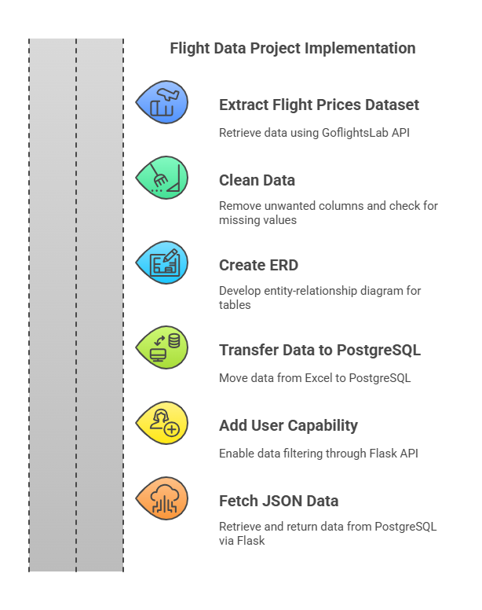

# Flight Data Analysis Project

## Team Members
1. James Garcia
2. Lovecy Thomas
3. Seyhr Waqas

## Project Overview & Rationale
The objective of this project is to create a detailed flight data analysis using PostgreSQL, Flask, and an ETL pipeline. The project will involve calling the API of GoFlightLabs to create CSV files for each month, covering the period from March 2025 to February 2026. These files, specifically detailing flights from Toronto, Montreal, and Ottawa to Texas, will then be merged and processed to form a well-normalized database. Separate tables for airports and airlines will be created to achieve 3NF. A Flask API will facilitate user interaction with the processed data, enabling efficient querying of flight prices, itineraries, and airline specifics.

### Rationale
- **Data-Driven Travel Decisions**: Flight prices fluctuate frequently. Analyzing this data can provide insights into price trends and the best times to book.
- **Efficient Flight Data Management**: The ETL process will clean, structure, and store data in a normalized format for better accessibility.
- **Real-World Applications**: Airlines, travel agencies, and consumers can use this system to retrieve flight details efficiently via a user-friendly API.

### Stakeholders
The insights from this project can be valuable for:
- Travelers looking for the most affordable flights.
- Airlines to assess competitive pricing strategies.
- Travel agencies to recommend budget-friendly months to customers.

## Technologies Used
- **Python** (Pandas, Flask, Pandera, ydata_profiling)
- **PostgreSQL** (AWS RDS)
- **APIs** (GoFlightLabs)
- **Jupyter Notebooks** (for data processing)

## Folder Structure

## API Workflow
We utilized GoFlightLabs APIs to fetch:
- **Airport Data API** – Retrieves airport details.
- **Airline Data API** – Provides airline-related information.
- **Flight Price Data API** – Fetches real-time flight pricing data.

### ETL (Extract, Transform, Load)
- Collected data for airports (Canada & U.S.), airlines, and flight prices.
- Cleaned and standardized data (filtered busiest airports, formatted timestamps, extracted relevant details).
- Stored cleaned datasets in the `postgre_tables` folder in CSV format.

### Flask API Development
- Built a RESTful API for querying one-way flight prices.
- Connected the API to AWS RDS (PostgreSQL).

## Data Storage & Validation
- **PostgreSQL** used for structured storage.
- **ydata_profiling** for dataset profiling.
- **Pandera** for data validation.

### Stakeholders:
The insights from this project can be valuable for:
•	Travelers looking for the most affordable flights.
•	Airlines to assess competitive pricing strategies.
•	Travel agencies to recommend budget-friendly months to customers.
### Dataset Links & Metadata:
https://www.goflightlabs.com/flight-prices
Dataset Licensing (under trial version): The dataset can be used only for personal and trial purposes. The trial version is not applicable for commercial purposes
https://www.goflightlabs.com/terms

###  Project Implementataion Strategy
 

### Steps in Project Implementation
1.Extract flight prices dataset using the API of GoflightsLab.
2. Clean the data (to list a few)
    a. Remove unwanted columns.
    b. Check for missing values.
    c. Convert the departure and arrival time to datetime format.
    d. Split the departure field to departure date and departure time. Follow the same for arrival field.
    e. Perform 3NF- Creating separate table for the airline and airport information.
3. Create an ERD for the tables and determine the primary and foreign keys.
4. Getting the file to go from excel to PostgreSQL directly.
5. Add user capability to extract filtered data in Flask API.
6. Fetching Json data from PostgreSQL and returning user’s requirement through Flask API.

### Data Limitations
1.	Data Accuracy: The dataset from GoflightsLab is provided under a trial version and may not be fully comprehensive. Its accuracy depends on the information supplied by the API.
2.	Licensing Restrictions: This dataset is intended for personal and trial use only. Commercial applications are not permitted under the trial version.
3.	Temporal Coverage: The data spans from March 2025 to February 2026, limiting any analysis to this specific timeframe.
4.	Geographical Scope: The dataset includes flights departing from Toronto, Montreal, and Ottawa to Texas. Findings may not be applicable to other routes or regions.
5.	Dynamic Nature of Data: Flight prices fluctuate due to factors such as demand, fuel costs, and airline policies. The extracted data may not reflect real-time changes.
