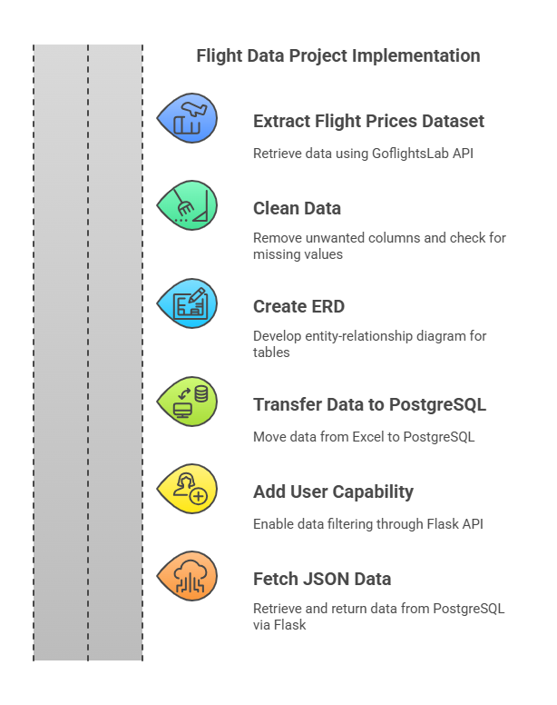
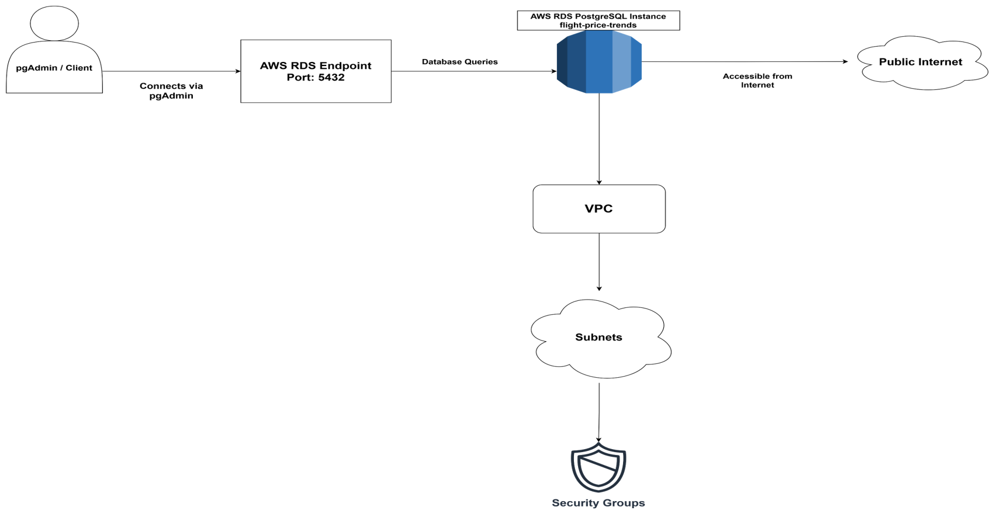
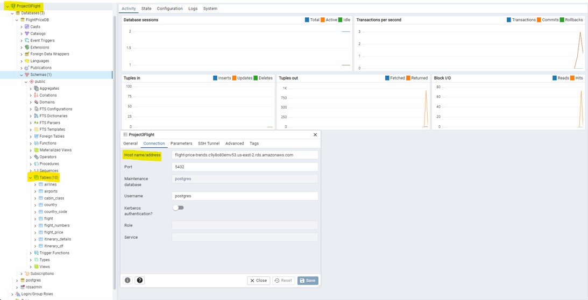
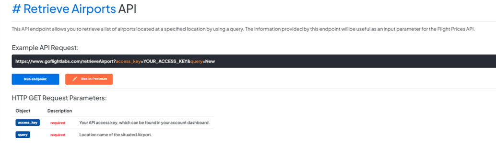
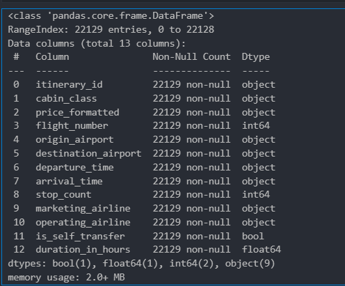
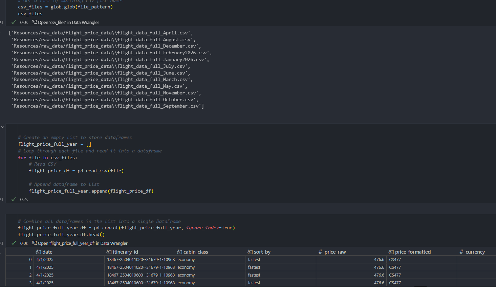
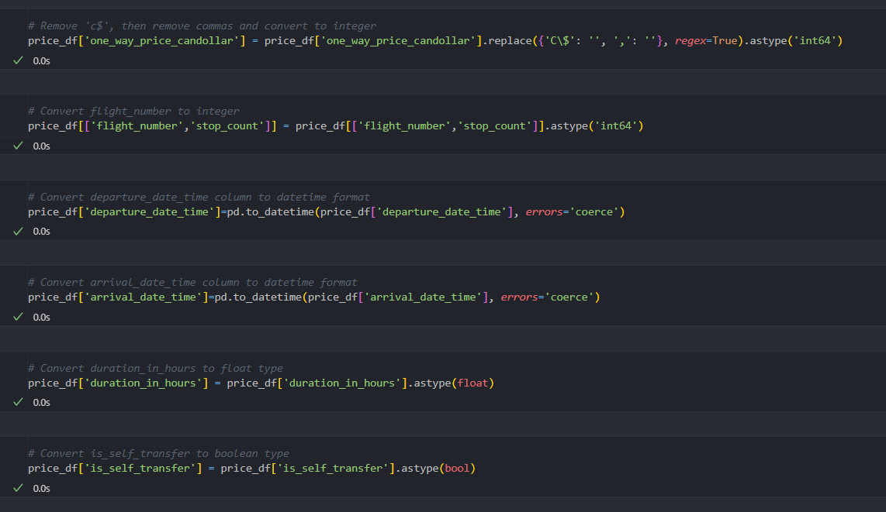

# Flight Data Analysis Project

## Team Members
- James Garcia
- Lovecy Thomas
- Seyhr Waqas

## Project Overview & Rationale
The objective of this project is to create a detailed flight data analysis using PostgreSQL, Flask, and an ETL pipeline. The project will involve calling the API of GoFlightLabs to create CSV files for each month, covering the period from March 2025 to February 2026. These files, specifically detailing flights from Toronto, Montreal, and Ottawa to Texas, will then be merged and processed to form a well-normalized database. Separate tables for airports and airlines will be created to achieve 3NF. A Flask API will facilitate user interaction with the processed data, enabling efficient querying of flight prices, itineraries, and airline specifics.

### Rationale
- **Data-Driven Travel Decisions:** Flight prices fluctuate frequently. Analyzing this data can provide insights into price trends and the best times to book.
- **Efficient Flight Data Management:** The ETL process will clean, structure, and store data in a normalized format for better accessibility.
- **Real-World Applications:** Airlines, travel agencies, and consumers can use this system to retrieve flight details efficiently via a user-friendly API.

### Stakeholders
The insights from this project can be valuable for:
- Travelers looking for the most affordable flights.
- Airlines to assess competitive pricing strategies.
- Travel agencies to recommend budget-friendly months to customers.

## Project Implementation Strategy

## Technologies Used
- **Python** (Pandas, Flask, Pandera, ydata_profiling)
- **PostgreSQL** (AWS RDS)
- **APIs** (GoFlightLabs)
- **Jupyter Notebooks** (for data processing)

## How to intereact with project 

## Folder Structure
    /Resources # raw_data 
    /FinalProject3March 
        /Postgres_data
        /cleaning_output 
        code_for_api.ipynb
        data_cleaning.pynb
        table_creation_validation.ipynb (2 HTML generated)
        app.py (for Flask)
        
        ERD.png
        table_creation.sql  # database schema                                                
                                                                
## How to run the Project
- Run code_for_api.ipynb to retrieve data via API calls.
  The raw data will be saved in the /Resources folder.
- Run data_cleaning.ipynb to remove duplicates and doing mapping
  Generate the final cleaned CSV files (stored in /cleaning_output).
- Run table_creation_validation.ipynb to Create dataframes and data validation
  and save data into the /Postgres_data folder.
- Setup a database in AWS RDS as per the architectural diagram. after including all the requirements
  I obtained a endpoint. 
- In pgAdmin, created a server and then in connection on pgadmin used that endpoint to connect with   AWS RDS
- run the table_creation.sql to create tables
- import data from postgres_data
- Execute app.py to start the API and interact with the processed data.

## API Workflow
We utilized GoFlightLabs APIs to fetch:
- **Airport Data API:** Retrieves airport details.
- **Airline Data API:** Provides airline-related information.
- **Flight Price Data API:** Fetches real-time flight pricing data.

### ETL (Extract, Transform, Load)
- Collected data for airports (Canada & U.S.), airlines, and flight prices.
- Cleaned and standardized data (filtered busiest airports, formatted timestamps, extracted relevant details).
- Stored cleaned datasets in the `postgre_tables` folder in CSV format.

## Data Storage & Validation
- **PostgreSQL:** Used for structured storage.
- **ydata_profiling:** For dataset profiling.
- **Pandera:** For data validation.

### Flask API Development
- Built a RESTful API for querying one-way flight prices.
- Connected the API to AWS RDS (PostgreSQL).

## Sample Code for API Call

## Sample Code for ETL Process

## How we merge the file

## Resources
- [GoFlightLabs Flight Prices](https://www.goflightlabs.com/flight-prices) 
- **Dataset Licensing (under trial version):** The dataset can be used only for personal and trial   -  purposes. The trial version is not applicable for commercial purposes. 
    [Terms](https://www.goflightlabs.com/terms)

- https://www.youtube.com/watch?v=0A-5ITILrMA

## Data Limitations
- **Data Accuracy:** The dataset from GoFlightLabs is provided under a trial version and may not be fully comprehensive. Its accuracy depends on the information supplied by the API.
- **Licensing Restrictions:** This dataset is intended for personal and trial use only. Commercial applications are not permitted under the trial version.
- **Temporal Coverage:** The data spans from March 2025 to February 2026, limiting any analysis to this specific timeframe.
- **Geographical Scope:** The dataset includes flights departing from Toronto, Montreal, and Ottawa to Texas. Findings may not be applicable to other routes or regions.
- **Dynamic Nature of Data:** Flight prices fluctuate due to factors such as demand, fuel costs, and airline policies. The extracted data may not reflect real-time changes.
